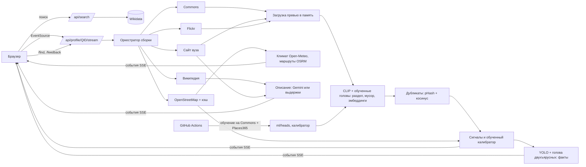

# Candid AI

Сервис, который по названию университета за полминуты собирает проверенный визуальный профиль кампуса: фото корпусов, общежитий, аудиторий, библиотек, лабораторий, спорта и города из открытых источников. У каждого фото есть кликабельный источник, автор, лицензия, даты и показатель достоверности с разбором. Сервис не только раскладывает фото по разделам, но и читает их: считает кровати в комнатах общежитий и отличает двухъярусные, сверяет фото спортобъектов с картой, показывает путь от общежития до корпуса и климат. Два вуза можно сравнить по фактам с фото-доказательствами.

LOCUS Startup Hackathon 2026, кейс 1 «Визуальный профиль университета», код участия `LOCUSCASE1`.

- Рабочий сайт: `ССЫЛКА НА HF SPACE` (заполнить после деплоя, вид `https://<user>-candid-ai.hf.space`)
- Демо-видео: `ССЫЛКА` (заполнить)
- Презентация: `ССЫЛКА` (заполнить)
- Вход не нужен: сайт работает без регистрации.

## Задача

Абитуриент видит рекламные страницы вуза, а достоверные фото кампуса, общежитий и аудиторий разбросаны по десяткам источников, дублируются, устаревают и часто относятся к другому месту. Нужен сервис, который по названию вуза быстро находит изображения, проверяет принадлежность, убирает дубли и мусор, распределяет фото по категориям и показывает источники. Если подтвердить фото нельзя, сервис должен честно понизить достоверность или сказать, что данных мало.

## Решение

1. **Поиск вуза.** Название, аббревиатура (ЕНУ, КазНУ, SDU), название с опечаткой или адрес сайта разрешается через Wikidata: полнотекстовый поиск с фильтром по типу «учебное заведение», нечёткий поиск, транслитерация ru/kk/en, словарь сокращений, поиск по свойству P856 (сайт). Если подходит несколько вузов, пользователь выбирает из карточек. Если ничего не найдено, показывается подсказка «возможно, вы имели в виду».
2. **Сбор кандидатов параллельно.** Wikimedia Commons (категория вуза, файлы с геометкой рядом с кампусом, поиск по названию), официальный сайт вуза (страницы про общежития, кампус, библиотеку, спорт, студенческую жизнь, галерею, с учётом robots.txt), Flickr (свободные лицензии, если задан ключ), фото города вокруг его центра. Граница кампуса и объекты рядом берутся из OpenStreetMap: зеркала Overpass опрашиваются параллельно, ответ кэшируется, а если Overpass не успел, загрузка продолжается в фоне и карта обновляется в уже открытом профиле.
3. **Анализ партиями по мере ответа источников.** OpenCLIP относит фото к разделу и отсеивает логотипы, афиши, карты, марки и портреты. Поверх CLIP работают **линейные головы, обученные на открытых данных** (см. «Обучение»), итог смешивается с zero-shot классификацией. Дубликаты склеиваются по перцептивному хэшу и эмбеддингам. Фотобанки отклоняются.
4. **Проверка принадлежности.** Сигналы: геометка относительно границы кампуса и других вузов рядом, название вуза в подписи и категориях, тип источника, сходство с эталонным фото вуза, уверенность классификатора, признаки мусора и водяного знака. **Обученная логистическая модель** переводит их в достоверность 0–100. Порог «подтверждено» подобран так, чтобы точность выше него на кросс-валидации была не ниже 92%; ниже порога «вероятно» фото уходит в «Не подтверждено» и в фонд не входит.
5. **Факты из фото.** YOLO11 находит кровати, столы, технику на фото общежитий; каждая найденная кровать отдельно классифицируется как двухъярусная или обычная (обученная голова на вырезках кроватей). Факт считается по независимым фото (копии одного кадра не считаются повторно), при нехватке фото показывается «мало данных». Спортобъекты подтверждаются, когда совпадают фото и объект OpenStreetMap. При наведении на факт на фото появляются рамки-доказательства.
6. **Город и дорога.** Климат по месяцам за 5 лет (Open-Meteo, ERA5), время от центра города и пешком от общежитий до главного корпуса (OSRM на данных OSM), остановки, магазины и аптеки рядом. «15 минут пешком при −14 °C в январе» считается из реальных данных. Стоимость жизни: открытых данных с датой нет, сервис так и пишет.
7. **Описание кампуса.** Gemini пишет 3–5 предложений только по найденным текстам (Википедия, сайт вуза) со сносками. Каждое предложение проверяется: указан существующий источник, все числа есть в источнике. Без ключа показываются выдержки из источников без генерации.
8. **Сравнение вузов.** `/compare?a=Q…&b=Q…`: два профиля собираются параллельно, таблица фактов, фото по разделам, климат и дорога, в каждой ячейке фото-доказательство, фильтр «только различия», ссылка на сравнение.
9. **Прозрачность и обратная связь.** Живой прогресс с реальным таймером и статусом каждого источника, раздел «Изъято из фонда» с причиной, разбор вклада сигналов в карточке, фильтры «с геометкой / без сайта вуза / за последние 5 лет», поиск внутри профиля по содержанию кадров («бассейн», «двухъярусные кровати»), кнопки «Это не тот вуз / Не тот раздел / Всё верно», которые копятся для дообучения.

## Обучение моделей на открытых данных

Всё обучение воспроизводимо и запускается в GitHub Actions (workflow **Train models**, `.github/workflows/train.yml`), результаты коммитятся в `ml/`.

| Что | Данные | Как | Результат |
|---|---|---|---|
| Голова разделов и «мусора» (15 классов) | Wikimedia Commons: ~60 тематических категорий (Lecture halls, Dormitory rooms, Indoor swimming pools, Logos, Posters, Floor plans…), до 320 фото на класс; Places365-Standard (MIT CSAIL, CC BY): 30 классов сцен по 100 фото | эмбеддинги той же модели CLIP, чистка явных ошибок разметки, разбиение 70/15/15 по подкатегориям Commons, логистическая регрессия, подбор C и веса смеси с zero-shot на валидации | `ml/heads/category.json` |
| Помещения общежития, виды спортобъектов | те же источники, свои категории | то же | `ml/heads/dorm_sub.json`, `sport_sub.json` |
| Двухъярусная кровать | Commons: Bunk beds, Single beds, Beds, Bedrooms; Places365 | YOLO вырезает кровати, голова учится на вырезках, как в работающем сервисе | `ml/heads/bunk.json` |
| Достоверность | слабая разметка по деревьям категорий Commons 42 вузов (Казахстан, Центральная Азия, Россия, мир) с трудными отрицательными из того же города | признаки тем же кодом, что в сервисе; кросс-валидация по вузам; порог по целевой точности | `ml/calibrator_weights.json` |
| Скорость | 10 запросов жюри-сценария: аббревиатуры, опечатка, региональный, зарубежный, несуществующий | сборка без кэша | `ml/BENCHMARK.md` |

Метрики после прогона: **`ml/REPORT.md`** (точность zero-shot, головы и смеси на отложенной выборке, F1 по классам, проверка на независимом ручном наборе из 43 фото, размеченных до обучения) и страница «Как это работает» на сайте, которая читает их из `/api/health`. Сюда цифры переносятся только после прогона, заранее ничего не выдумано.

Ручная проверка: `data/benchmark_sheet.html` из артефакта CI, отметить неверные фото, страница сама посчитает precision@15.

Сделать всё локально (нужна сеть и ~2 ГБ места):

```bash
python ml/fetch_eval_images.py
python ml/build_dataset.py          # фото Commons + Places365 в data/images
python ml/train_heads.py            # головы и ml/REPORT.md
python ml/build_calibrator_data.py  # слабая разметка
python ml/train_calibrator.py data/labels/*.jsonl
python ml/seed_osm_cache.py         # карты частых вузов
python ml/benchmark.py              # ml/BENCHMARK.md
```

## Стек

| Часть | Технологии |
|---|---|
| Бэкенд | Python 3.11, FastAPI, httpx (async), Server-Sent Events |
| ML | PyTorch (CPU), OpenCLIP ViT-B/32 (LAION-400M), свои линейные головы (scikit-learn), Ultralytics YOLO11s (COCO), ImageHash, NumPy |
| Данные | Wikidata API, Wikimedia Commons API, Overpass API (OpenStreetMap), OSRM (FOSSGIS), Open-Meteo, Wikipedia REST API, Flickr API, сайты вузов, Places365 (обучение) |
| Текст | Google Gemini API (AI Studio), RapidFuzz, selectolax |
| Фронтенд | React 19, TypeScript, Vite, React Router, шрифты Golos Text и PT Mono (Fontsource), подложка карты CARTO |
| Инфраструктура | Docker, Hugging Face Spaces, GitHub Actions (CI, обучение, выкладка, keep-alive) |

## Архитектура



Структура репозитория:

```
backend/app/
  main.py               HTTP API, SSE, поиск по фото, отметки, прогрев кэша, раздача фронтенда
  cache.py              дисковый кэш JSON (+ заранее собранный backend/seed_cache)
  search/               Wikidata: поиск, сокращения, адрес сайта, карточка вуза
  sources/              commons, official_site, flickr, osm, wikipedia, context (климат, маршруты)
  vision/               загрузка, CLIP и промпты, обученные головы, дубликаты, YOLO, текстовый поиск
  verify/               сигналы, фотобанки, логистический калибратор
  facts/engine.py       факты общежитий (в том числе двухъярусные кровати) и спорта
  describe/             описание по источникам со сносками
  pipeline/             оркестратор и журнал событий сборки
backend/seed_cache/     сжатые карты OSM частых вузов
backend/tests/          модульные тесты, API, сквозная офлайн-сборка, офлайн-сервер
frontend/src/           интерфейс (профиль, сравнение, документы)
ml/                     сбор данных, обучение голов и калибратора, бенчмарк, веса и отчёты
scripts/                загрузка моделей, скриншоты, выкладка на Hugging Face
.github/workflows/      CI, Train models, Deploy to Hugging Face, Keep Space awake
```

Сборка профиля идёт потоком событий: `university`, `campus`, `context`, `source`, `photos`, `photo_update`, `rejected`, `progress`, `boxes`, `facts`, `description`, `done`. Первые подтверждённые фото появляются, как только ответил первый источник. Общий бюджет сборки 27 секунд: источники, не успевшие ответить, отменяются, и интерфейс об этом сообщает.

**Кэш (раскрыт по правилам):** готовые профили 6 часов (повторное открытие отмечено «показано из кэша», кнопка «Пересобрать без кэша»), граница кампуса 7 дней, климат и маршруты 14 дней. В `backend/seed_cache` лежат сжатые ответы Overpass для частых вузов, собранные скриптом `ml/seed_osm_cache.py`, потому что публичные зеркала Overpass в часы пик отвечают минутами. Фото нигде не кэшируются.

API документировано в Swagger: `/docs`.

## Запуск

### Локально

```bash
git clone https://github.com/zhomarterkhainar-svg/locus.git && cd locus
cp .env.example .env              # вписать GEMINI_API_KEY, по желанию FLICKR_API_KEY
pip install torch torchvision --index-url https://download.pytorch.org/whl/cpu
pip install -r backend/requirements.txt
python scripts/download_models.py # ~620 МБ весов с GitHub Releases
cd frontend && npm ci && npm run build && cd ..
uvicorn app.main:app --app-dir backend --port 8000
# открыть http://localhost:8000
```

Для разработки фронтенда: `cd frontend && npm run dev` (прокси `/api` на порт 8000).

### Docker

```bash
docker build -t candid-ai .
docker run -p 7860:7860 --env-file .env candid-ai
```

## Хостинг на Hugging Face Spaces (бесплатно, 2 vCPU, 16 ГБ)

1. Зарегистрироваться на huggingface.co → **New Space** → имя `candid-ai`, SDK **Docker**, шаблон **Blank**, железо **CPU basic (free)**, видимость **Public**.
2. В Space → **Settings → Variables and secrets** добавить секреты `GEMINI_API_KEY` (и по желанию `FLICKR_API_KEY`).
3. На huggingface.co → **Settings → Access Tokens** создать токен с правом **Write**.
4. В GitHub-репозитории → **Settings → Secrets and variables → Actions**:
   - секрет `HF_TOKEN` = токен из шага 3;
   - секрет `GEMINI_API_KEY` (нужен обучению для описаний в бенчмарке, необязательно);
   - переменная `HF_SPACE` = `ваш-логин/candid-ai`;
   - переменная `HF_SPACE_URL` = `https://ваш-логин-candid-ai.hf.space` (для keep-alive).
5. В репозитории → **Settings → Actions → General → Workflow permissions** выбрать **Read and write permissions** (обучение коммитит веса).
6. Запушить в `main`. Workflow **Deploy to Hugging Face** выложит код, **Train models** обучит модели (30–90 минут), закоммитит веса и выложит ещё раз. Ручной запуск: вкладка **Actions** → workflow → **Run workflow**.
7. Первая сборка образа на Hugging Face 10–15 минут, дальше Space доступен по `https://ваш-логин-candid-ai.hf.space`. Workflow **Keep Space awake** открывает его раз в 6 часов, чтобы бесплатный Space не уснул до объявления результатов.

Без GitHub Actions: `HF_TOKEN=... HF_SPACE=логин/candid-ai bash scripts/deploy_hf.sh`.

## Тестовый сценарий для жюри

1. Открыть сайт, ввести «ЕНУ» и нажать «Найти». Откроется профиль Евразийского национального университета.
2. Смотреть на таймер и счётчики: фото появляются по мере проверки, внизу строки видно, какой источник ответил и за сколько.
3. Переключить разделы «Общежития», «Спорт», «Лаборатории», «Студенческая жизнь». У разделов с малым числом фото стоит отметка «мало». Включить фильтры «с геометкой», «без сайта вуза», «за последние 5 лет».
4. Открыть любую карточку: источник кликабелен, видны автор, лицензия, даты, место относительно кампуса и вклад каждого сигнала в достоверность. Отметить «Это не тот вуз».
5. Навести курсор на факт «Кроватей на фото комнаты» или «Двухъярусные кровати»: на фото-доказательствах появятся рамки детектора.
6. В поле «Найти на фото» ввести «бассейн» или «двухъярусные кровати».
7. Посмотреть блок «Город и дорога»: время от общежития до корпуса, климат по месяцам, остановки рядом.
8. Нажать «Сравнить с другим вузом», выбрать Nazarbayev University, включить «только различия».
9. Раскрыть «Изъято из фонда»: дубликаты, фотобанки, логотипы, снимки далеко от кампуса с причинами.
10. Ввести вуз, которого нет в демо, затем название с опечаткой, адрес сайта (`kimep.kz`) и несуществующее название: сервис предложит варианты или честно скажет, что вуз не найден.
11. Проверить мобильную версию: тот же путь работает на ширине телефона.

## Проверка качества

- `cd backend && pytest`: модульные тесты разбора ответов Wikidata и OpenStreetMap, геометрии кампуса, кэша и фоновой догрузки Overpass, климата и маршрутов, обученных голов, текстового поиска, фактов (в том числе двухъярусных кроватей), API поиска по фото и отметок, сквозная офлайн-сборка профиля с подменёнными API. CI гоняет тесты и сборку фронтенда на каждый пуш.
- `python ml/eval_categories.py`: проверка разделов на 43 фото Commons с ручной разметкой. На zero-shot промптах 85% совпадений раздела на первых 39 фото и 97% верных решений «мусор или фото кампуса». Набор маленький, это санитарная проверка; после обучения та же проверка для головы записывается в `ml/REPORT.md`.
- Метрики обученных моделей и скорости: `ml/REPORT.md`, `ml/BENCHMARK.md`, `ml/calibrator_weights.json` (после workflow Train models).

## Роли команды

| Участник | Роль |
|---|---|
| заполнить | капитан, бэкенд и ML |
| заполнить | фронтенд и дизайн |
| заполнить | данные, разметка, презентация |

## Источники данных

- [Wikidata](https://www.wikidata.org): карточка вуза, координаты, город, сайт, категория Commons. CC0.
- [Wikimedia Commons](https://commons.wikimedia.org): фото с авторами и свободными лицензиями, указанными на странице каждого файла; тематические категории для обучения.
- [OpenStreetMap](https://www.openstreetmap.org) через Overpass API: граница кампуса, общежития, корпуса, библиотеки, спортобъекты, остановки, магазины, аптеки. ODbL, © участники OpenStreetMap.
- [OSRM](https://routing.openstreetmap.de) (FOSSGIS): пешие и автомобильные маршруты по данным OSM.
- [Open-Meteo](https://open-meteo.com) Historical Weather API (ERA5): климат по месяцам. CC BY 4.0.
- [CARTO basemaps](https://carto.com/attributions): подложка карты, © OpenStreetMap, © CARTO.
- [Википедия](https://ru.wikipedia.org) REST API: краткие выдержки для описания. CC BY-SA.
- Официальные сайты вузов (свойство P856 в Wikidata): изображения и тексты страниц, показываются превью со ссылкой на страницу, права у правообладателя.
- [Flickr API](https://www.flickr.com/services/api/): только фото под лицензиями Creative Commons и Public Domain, при наличии ключа.
- [Places365](http://places2.csail.mit.edu/) (MIT CSAIL, CC BY): сцены для обучения голов, в продукте не показываются.

Фото не копируются на сервер: они скачиваются в память только для анализа, пользователю показывается превью по адресу источника. Обучающие фото лежат только на машине обучения и в репозиторий не попадают, их список с лицензиями в артефакте CI (`data/manifest.jsonl`).

## AI и API

| Компонент | Для чего | Где в коде |
|---|---|---|
| OpenCLIP ViT-B-32-quickgelu, веса LAION-400M e32 | раздел фото, мусор, водяной знак, эмбеддинги для дубликатов, сходства с эталоном и поиска по фото | `backend/app/vision/clip_model.py`, `categories.py`, `textsearch.py` |
| Линейные головы (свои, обучены на Commons и Places365) | разделы, помещения общежития, виды спорта, двухъярусные кровати | `backend/app/vision/heads.py`, `ml/train_heads.py` |
| Ultralytics YOLO11s, COCO | кровати, столы, стулья, кухонная техника и сантехника на фото общежитий | `backend/app/vision/detector.py` |
| Логистический калибратор (свой, обучен на слабой разметке) | достоверность из сигналов | `backend/app/verify/`, `ml/build_calibrator_data.py`, `ml/train_calibrator.py` |
| Google Gemini (модель задаётся `GEMINI_MODEL`) | описание кампуса только по найденным текстам; перевод редких запросов поиска по фото | `backend/app/describe/describe.py`, `vision/textsearch.py` |
| Wikidata, Commons, Overpass, OSRM, Open-Meteo, Wikipedia, Flickr API | данные и изображения | `backend/app/search/`, `backend/app/sources/` |

## Готовые компоненты и ранее созданные материалы

Вся логика кейса написана в период хакатона (16–19 сентября 2026), история видна в Git. Использованы готовые open-source библиотеки и предобученные модели из таблиц выше, шрифты Golos Text и PT Mono (SIL OFL) через Fontsource, подложка карты CARTO. Готовых шаблонов, UI-китов и ранее созданной инфраструктуры нет. Заранее собранный кэш карт OSM (`backend/seed_cache`) создан скриптом из этого репозитория и раскрыт выше. При разработке использовался ИИ-ассистент Claude для написания кода и дизайна (с навыками impeccable для дизайна и Playwright для скриншотов), это разрешено правилами хакатона.

## Ограничения

- Сервис видит только открытые источники. У вузов без категории на Commons, без геометок и без сайта в Wikidata фото будет мало, разделы честно помечаются «мало».
- Лучше всего покрыты вузы Казахстана и Центральной Азии с заполненной страницей Wikidata. Для других стран работает тот же механизм, но данных может быть меньше.
- Обучающие метки Commons шумные: категория описывает тему файла, а не всегда содержание кадра. Калибратор обучен на слабой разметке; отметки пользователей постепенно добавляют ручную.
- Классификатор двухъярусных кроватей ошибается на ракурсах сверху и в плохом свете; кровати за кадром не видны. Факт «стол на каждого» не утверждается.
- Overpass API часто перегружен: тогда проверка фото идёт по точке из Wikidata, а граница догружается в фоне; для частых вузов карта уже лежит в кэше.
- Бесплатный Space на Hugging Face работает на CPU: при одновременных сборках нескольких профилей время растёт.
- Стоимость жизни не показывается: открытых данных с датой не нашлось.

## Техническая справка

**Модели и библиотеки.** PyTorch CPU, open_clip_torch, ultralytics, scikit-learn (обучение), imagehash, numpy, rapidfuzz, selectolax, httpx, FastAPI, uvicorn, pydantic-settings, Pillow; React, React Router, Vite, TypeScript.

**Внешние сервисы.** Wikidata API, Wikimedia Commons API, Overpass API (четыре зеркала параллельно), OSRM FOSSGIS, Open-Meteo, Wikipedia REST API, Flickr API, Google Gemini API, CARTO basemaps, сайты вузов, GitHub Actions, Hugging Face Spaces.

**Методы проверки результата.** Геосигнал: расстояние до мультиполигона кампуса OSM, найденного по тегу `wikidata`, с проверкой близости к другим вузам. Текстовый сигнал: совпадение полных названий и сокращений на трёх языках с транслитерацией. Источниковый сигнал: способ, которым найден кандидат. Визуальный сигнал: косинусное сходство CLIP с главным фото вуза. Разделы: смесь обученной головы и zero-shot. Дубликаты: pHash (расстояние до 6) или косинус эмбеддингов от 0,955. Фотобанки: список доменов и признаки в адресе. Описание: проверка источника и чисел для каждого предложения. Факты: подсчёт по независимым кластерам, пороги уверенности детектора (кровать от 0,45, двухъярусная от 0,6). Оценка: отложенные выборки с групповым разбиением, кросс-валидация калибратора по вузам, независимый ручной набор, бенчмарк скорости, лист ручной проверки precision@15.

**Меры безопасности.** Ключи только в переменных окружения на сервере и в секретах GitHub/Hugging Face (`.env` в `.gitignore`, в репозитории `.env.example`), в браузер не передаются. Ограничение частоты новых сборок (8 в минуту) и отметок (30 в минуту) по IP, кэш готовых профилей. Скачивание изображений с лимитом размера (6 МБ), тайм-аутом и проверкой типа содержимого, декодирование с ограничением числа пикселей. Уважение robots.txt при обходе сайтов вузов, User-Agent с контактом по правилам Wikimedia. Заголовки `X-Content-Type-Options`, `Referrer-Policy: no-referrer`, `X-Frame-Options`. Отметки пользователей хранятся без IP. Персональные данные не собираются, см. политику конфиденциальности на сайте.

## Лицензии

Ultralytics YOLO распространяется под AGPL-3.0, поэтому исходный код проекта публикуется открыто. OpenCLIP под MIT. Фото принадлежат их авторам на условиях, указанных у источника. Данные OpenStreetMap под ODbL.
