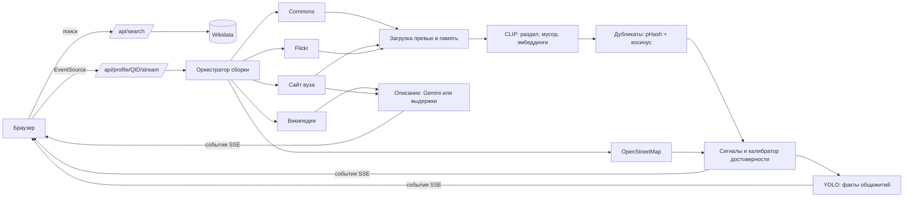

# Candid AI

Сервис, который по названию университета за полминуты собирает проверенный визуальный профиль кампуса: фото корпусов, общежитий, аудиторий, библиотек, лабораторий, спорта и города из открытых источников. У каждого фото есть кликабельный источник, автор, лицензия, даты и показатель достоверности с разбором. Сервис не только раскладывает фото по разделам, но и читает их: считает кровати в комнатах общежитий, сверяет фото спортобъектов с картой.

LOCUS Startup Hackathon 2026, кейс 1 «Визуальный профиль университета», код участия `LOCUSCASE1`.

- Рабочий сайт: `ССЫЛКА НА HF SPACE` (заполнить после деплоя)
- Демо-видео: `ССЫЛКА` (заполнить)
- Презентация: `ССЫЛКА` (заполнить)

## Задача

Абитуриент видит рекламные страницы вуза, а достоверные фото кампуса, общежитий и аудиторий разбросаны по десяткам источников, дублируются, устаревают и часто относятся к другому месту. Нужен сервис, который по названию вуза быстро находит изображения, проверяет принадлежность, убирает дубли и мусор, распределяет фото по категориям и показывает источники. Если подтвердить фото нельзя, сервис должен честно понизить достоверность или сказать, что данных мало.

## Решение

1. **Поиск вуза.** Название, аббревиатура (ЕНУ, КазНУ, SDU) или название с опечаткой разрешается через Wikidata: полнотекстовый поиск с фильтром по типу «учебное заведение», нечёткий поиск, транслитерация ru/kk/en и словарь сокращений. Если подходит несколько вузов, пользователь выбирает из карточек. Если ничего не найдено, показывается подсказка «возможно, вы имели в виду».
2. **Сбор кандидатов параллельно.** Wikimedia Commons (категория вуза, файлы с геометкой рядом с кампусом, поиск по названию), официальный сайт вуза (страницы про общежития, кампус, библиотеку, спорт, студенческую жизнь, галерею, с учётом robots.txt), Flickr (свободные лицензии, если задан ключ), фото города вокруг его центра. Граница кампуса и объекты рядом берутся из OpenStreetMap.
3. **Анализ партиями по мере ответа источников.** OpenCLIP относит фото к разделу и отсеивает логотипы, афиши, карты, марки и портреты. Дубликаты склеиваются по перцептивному хэшу и эмбеддингам. Фотобанки отклоняются.
4. **Проверка принадлежности.** Сигналы: геометка относительно границы кампуса и других вузов рядом, название вуза в подписи и категориях, тип источника, сходство с эталонным фото вуза, уверенность классификатора, признаки мусора и водяного знака. Логистическая модель переводит их в достоверность 0–100. От 75 фото подтверждено, от 50 вероятно, ниже уходит в «Не подтверждено» и в фонд не входит.
5. **Факты из фото.** YOLO11 находит кровати, столы, технику на фото общежитий. Факт считается по независимым фото (копии одного кадра не считаются повторно), при нехватке фото показывается «мало данных». Спортобъекты подтверждаются, когда совпадают фото и объект OpenStreetMap. При наведении на факт на фото появляются рамки-доказательства.
6. **Описание кампуса.** Gemini пишет 3–5 предложений только по найденным текстам (Википедия, сайт вуза) со сносками. Каждое предложение проверяется: указан существующий источник, все числа есть в источнике. Без ключа показываются выдержки из источников без генерации.
7. **Прозрачность.** Живой прогресс с реальным таймером и статусом каждого источника, раздел «Изъято из фонда» с причиной для каждого отклонённого фото, разбор вклада сигналов в карточке фото.

## Стек

| Часть | Технологии |
|---|---|
| Бэкенд | Python 3.11, FastAPI, httpx (async), Server-Sent Events |
| ML | PyTorch (CPU), OpenCLIP ViT-B/32 (LAION-400M), Ultralytics YOLO11s (COCO), ImageHash, NumPy |
| Данные | Wikidata API, Wikimedia Commons API, Overpass API (OpenStreetMap), Wikipedia REST API, Flickr API, сайты вузов |
| Текст | Google Gemini API (AI Studio), RapidFuzz, selectolax |
| Фронтенд | React 19, TypeScript, Vite, React Router, шрифты Golos Text и PT Mono (Fontsource) |
| Деплой | Docker, Hugging Face Spaces |

## Архитектура



Структура репозитория:

```
backend/app/
  main.py               HTTP API, SSE, раздача фронтенда, лимиты
  search/               Wikidata: поиск, сокращения, карточка вуза
  sources/              commons, official_site, flickr, osm, wikipedia
  vision/               загрузка, CLIP и промпты разделов, дубликаты, YOLO
  verify/               сигналы, фотобанки, логистический калибратор
  facts/engine.py       факты общежитий и спорта
  describe/             описание по источникам со сносками
  pipeline/             оркестратор и журнал событий сборки
backend/tests/          модульные тесты, сквозная офлайн-сборка, офлайн-сервер
frontend/src/           интерфейс
ml/                     веса калибратора, обучение, проверка категорий
scripts/                загрузка моделей, скриншоты
```

Сборка профиля идёт потоком событий: `university`, `campus`, `source`, `photos`, `photo_update`, `rejected`, `progress`, `boxes`, `facts`, `description`, `done`. Первые подтверждённые фото появляются, как только ответил первый источник. Общий бюджет сборки 27 секунд: источники, не успевшие ответить, отменяются, и интерфейс об этом сообщает. Готовые профили кэшируются на 6 часов, повторное открытие отмечено «показано из кэша», кнопка «Пересобрать без кэша» запускает сборку заново.

## Запуск

### Локально

```bash
git clone <репозиторий> && cd candid-ai
cp .env.example .env              # вписать GEMINI_API_KEY, по желанию FLICKR_API_KEY
pip install -r backend/requirements.txt
python scripts/download_models.py # ~620 МБ весов с GitHub Releases
cd frontend && npm ci && npm run build && cd ..
uvicorn app.main:app --app-dir backend --port 8000
# открыть http://localhost:8000
```

Для разработки фронтенда: `cd frontend && npm run dev` (прокси `/api` на порт 8000).

### Docker

```bash
docker build -t candid-ai .
docker run -p 7860:7860 --env-file .env candid-ai
```

### Hugging Face Spaces

Создать Space с типом Docker, загрузить репозиторий, заменить README Space на `deploy/huggingface/README.md`, в настройках Space добавить секреты `GEMINI_API_KEY` и `FLICKR_API_KEY`. Сервис поднимется на порту 7860. Первая загрузка моделей при старте занимает 10–20 секунд.

## Тестовый сценарий для жюри

1. Открыть сайт, ввести «ЕНУ» и нажать «Найти». Откроется профиль Евразийского национального университета.
2. Смотреть на таймер и счётчики: фото появляются по мере проверки, внизу строки видно, какой источник ответил и за сколько.
3. Переключить разделы «Общежития», «Спорт», «Лаборатории», «Студенческая жизнь». У разделов с малым числом фото стоит отметка «мало».
4. Открыть любую карточку: источник кликабелен, видны автор, лицензия, даты, место относительно кампуса и вклад каждого сигнала в достоверность.
5. Навести курсор на факт «Кроватей на фото комнаты»: на фото-доказательствах появятся рамки детектора.
6. Раскрыть «Изъято из фонда»: дубликаты, фотобанки, логотипы, снимки далеко от кампуса с причинами.
7. Ввести вуз, которого нет в демо (например, «Satbayev University» или «KIMEP»), затем название с опечаткой («Назарбаев унверситет») и несуществующее название.
8. Проверить мобильную версию: тот же путь работает на ширине телефона.

## Проверка качества

- `cd backend && pytest` : модульные тесты разбора ответов Wikidata и OpenStreetMap, геометрии кампуса, сигналов, фотобанков, проверки описания, движка фактов и сквозная офлайн-сборка профиля с подменёнными API (фото проверочного набора скачиваются `python ml/fetch_eval_images.py`).
- `python ml/eval_categories.py` : проверка промптов разделов на 43 фото Commons с ручной разметкой. На текущих промптах 85% совпадений раздела на первых 39 фото и 97% верных решений «мусор или фото кампуса». Набор маленький, это санитарная проверка, а не бенчмарк.
- Калибратор достоверности: веса в `ml/calibrator_weights.json` сейчас **заданы вручную** (`trained: false`), интерфейс это указывает. Обучение: выгрузить признаки `GET /api/profile/{QID}/features.jsonl`, проставить `label`, запустить `python ml/train_calibrator.py data/labels/*.jsonl`. Скрипт считает точность, Brier, ECE и точность на пороге 0,75 по 5-кратной кросс-валидации.

## Роли команды

| Участник | Роль |
|---|---|
| заполнить | капитан, бэкенд и ML |
| заполнить | фронтенд и дизайн |
| заполнить | данные, разметка, презентация |

## Источники данных

- [Wikidata](https://www.wikidata.org): карточка вуза, координаты, город, сайт, категория Commons. CC0.
- [Wikimedia Commons](https://commons.wikimedia.org): фото с авторами и свободными лицензиями, указанными на странице каждого файла.
- [OpenStreetMap](https://www.openstreetmap.org) через Overpass API: граница кампуса, общежития, корпуса, библиотеки, спортобъекты. ODbL, © участники OpenStreetMap.
- [Википедия](https://ru.wikipedia.org) REST API: краткие выдержки для описания. CC BY-SA.
- Официальные сайты вузов (свойство P856 в Wikidata): изображения и тексты страниц, показываются превью со ссылкой на страницу, права у правообладателя.
- [Flickr API](https://www.flickr.com/services/api/): только фото под лицензиями Creative Commons и Public Domain, при наличии ключа.

Фото не копируются на сервер: они скачиваются в память только для анализа, пользователю показывается превью по адресу источника.

## AI и API

| Компонент | Для чего | Где в коде |
|---|---|---|
| OpenCLIP ViT-B-32-quickgelu, веса LAION-400M e32 | zero-shot раздел фото, мусор, водяной знак, эмбеддинги для дубликатов и сходства с эталоном | `backend/app/vision/clip_model.py`, `categories.py` |
| Ultralytics YOLO11s, COCO | кровати, столы, стулья, кухонная техника и сантехника на фото общежитий | `backend/app/vision/detector.py` |
| Логистический калибратор (свой) | достоверность из сигналов, обучаемые веса | `backend/app/verify/`, `ml/train_calibrator.py` |
| Google Gemini (модель задаётся `GEMINI_MODEL`) | описание кампуса только по найденным текстам, JSON со ссылками на фрагменты | `backend/app/describe/describe.py` |
| Wikidata, Commons, Overpass, Wikipedia, Flickr API | данные и изображения | `backend/app/search/`, `backend/app/sources/` |

## Готовые компоненты и ранее созданные материалы

Вся логика кейса написана в период хакатона (16–19 сентября 2026), история видна в Git. Использованы готовые open-source библиотеки и предобученные модели из таблиц выше, шрифты Golos Text и PT Mono (SIL OFL) через Fontsource. Готовых шаблонов, UI-китов и ранее созданной инфраструктуры нет. При разработке использовался ИИ-ассистент Claude для написания кода и дизайна, это разрешено правилами хакатона.

## Ограничения

- Сервис видит только открытые источники. У вузов без категории на Commons, без геометок и без сайта в Wikidata фото будет мало, разделы честно помечаются «мало».
- Лучше всего покрыты вузы Казахстана и Центральной Азии с заполненной страницей Wikidata. Для других стран работает тот же механизм, но данных может быть меньше.
- Zero-shot классификатор путает похожие сцены: зал с рядами столов может оказаться «столовой», фасад спорткомплекса «кампусом». Геометка и название в подписи частично это исправляют.
- Детектор может посчитать двухъярусную кровать как одну и не видит кровати за кадром. Факт «стол на каждого» не утверждается.
- Веса калибратора пока ручные, до разметки проверочного набора.
- Overpass API иногда перегружен, тогда используется точка из Wikidata вместо границы кампуса, и это видно в статусе источника.

## Техническая справка

**Модели и библиотеки.** PyTorch CPU, open_clip_torch, ultralytics, imagehash, numpy, rapidfuzz, selectolax, httpx, FastAPI, uvicorn, pydantic-settings, Pillow; React, React Router, Vite, TypeScript.

**Внешние сервисы.** Wikidata API, Wikimedia Commons API, Overpass API (три зеркала по очереди), Wikipedia REST API, Flickr API, Google Gemini API, сайты вузов.

**Методы проверки результата.** Геосигнал: расстояние до мультиполигона кампуса OSM, найденного по тегу `wikidata`, с проверкой близости к другим вузам. Текстовый сигнал: совпадение полных названий и сокращений на трёх языках с транслитерацией. Источниковый сигнал: способ, которым найден кандидат. Визуальный сигнал: косинусное сходство CLIP с главным фото вуза. Дубликаты: pHash (расстояние до 6) или косинус эмбеддингов от 0,955. Фотобанки: список доменов и признаки в адресе. Описание: проверка источника и чисел для каждого предложения. Факты: подсчёт по независимым кластерам, пороги уверенности детектора (кровать от 0,45).

**Меры безопасности.** Ключи только в переменных окружения на сервере (`.env` в `.gitignore`, в репозитории `.env.example`), в браузер не передаются. Ограничение частоты новых сборок по IP (8 в минуту), кэш готовых профилей. Скачивание изображений с лимитом размера (6 МБ), тайм-аутом и проверкой типа содержимого, декодирование с ограничением числа пикселей. Уважение robots.txt при обходе сайтов вузов, User-Agent с контактом по правилам Wikimedia. Заголовки `X-Content-Type-Options`, `Referrer-Policy: no-referrer`, `X-Frame-Options`. Персональные данные не собираются, см. политику конфиденциальности на сайте.

## Лицензии

Ultralytics YOLO распространяется под AGPL-3.0, поэтому исходный код проекта публикуется открыто. OpenCLIP под MIT. Фото принадлежат их авторам на условиях, указанных у источника.
