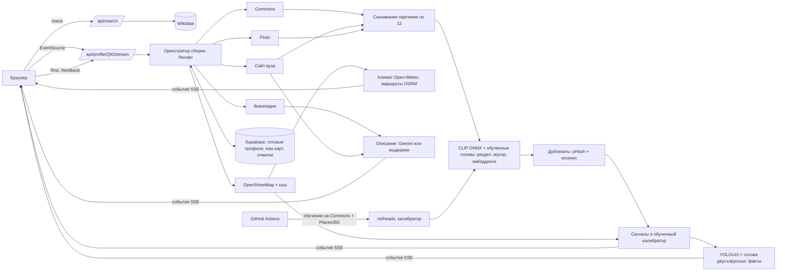

# Candid AI

Сервис, который по названию университета собирает проверенный визуальный профиль кампуса: фото корпусов, общежитий, аудиторий, библиотек, лабораторий, спорта и города из открытых источников. У каждого фото есть кликабельный источник, автор, лицензия, даты и показатель достоверности с разбором. Сервис не только раскладывает фото по разделам, но и читает их: считает кровати в комнатах общежитий и отличает двухъярусные, сверяет фото спортобъектов с картой, показывает путь от общежития до корпуса и климат. Два вуза можно сравнить по фактам с фото-доказательствами.

**Полезный профиль появляется за 4–6 секунд** (кейс разрешает 30), полная сборка с фактами, картой и описанием — медиана 7,5 секунды. Повторное открытие — доли секунды. Замер на сценарии жюри из десяти запросов: [`ml/BENCHMARK.md`](ml/BENCHMARK.md).

LOCUS Startup Hackathon 2026, кейс 1 «Визуальный профиль университета», код участия `LOCUSCASE1`.

- Рабочий сайт: `ССЫЛКА` (заполнить после деплоя, вид `https://candid-ai-web.onrender.com`)
- API: `ССЫЛКА НА RENDER` (вид `https://candid-ai-api.onrender.com`, документация `/docs`)
- Демо-видео: `ССЫЛКА` (заполнить)
- Презентация: `ССЫЛКА` (заполнить)
- Вход не нужен: сайт работает без регистрации.

## Задача

Абитуриент видит рекламные страницы вуза, а достоверные фото кампуса, общежитий и аудиторий разбросаны по десяткам источников, дублируются, устаревают и часто относятся к другому месту. Нужен сервис, который по названию вуза быстро находит изображения, проверяет принадлежность, убирает дубли и мусор, распределяет фото по категориям и показывает источники. Если подтвердить фото нельзя, сервис должен честно понизить достоверность или сказать, что данных мало.

## Решение

1. **Поиск вуза.** Название, аббревиатура (ЕНУ, КазНУ, SDU), название с опечаткой или адрес сайта разрешается через Wikidata: полнотекстовый поиск с фильтром по типу «учебное заведение», нечёткий поиск, транслитерация ru/kk/en, словарь сокращений, поиск по свойству P856 (сайт). Если подходит несколько вузов, пользователь выбирает из карточек. Если ничего не найдено, показывается подсказка «возможно, вы имели в виду». Карточка выбранного вуза начинает грузиться сразу после выдачи поиска, ещё до клика.
2. **Сбор кандидатов параллельно.** Wikimedia Commons (категория вуза, файлы с геометкой рядом с кампусом, поиск по названию), официальный сайт вуза (страницы про общежития, кампус, библиотеку, спорт, студенческую жизнь, галерею, с учётом robots.txt), Flickr (свободные лицензии, если задан ключ), фото города вокруг его центра. Граница кампуса и объекты рядом берутся из OpenStreetMap: зеркала Overpass опрашиваются параллельно, ответ кэшируется на диске и в Supabase, а если Overpass не успел, загрузка продолжается в фоне и карта обновляется в уже открытом профиле.
3. **Анализ партиями по мере скачивания.** Фото не ждут самых медленных файлов: каждые 12 скачанных кадров сразу проходят модель и попадают в интерфейс. CLIP относит фото к разделу и отсеивает логотипы, афиши, карты, марки и портреты. Поверх CLIP работают **линейные головы, обученные на открытых данных** (см. «Обучение»), итог смешивается с zero-shot классификацией. Дубликаты склеиваются по перцептивному хэшу и эмбеддингам. Фотобанки отклоняются.
4. **Проверка принадлежности.** Сигналы: геометка относительно границы кампуса и других вузов рядом, название вуза в подписи и категориях, тип источника, сходство с эталонным фото вуза, уверенность классификатора, признаки мусора и водяного знака. **Обученная логистическая модель** переводит их в достоверность 0–100. Порог «подтверждено» подобран так, чтобы точность выше него на кросс-валидации была не ниже 92%; ниже порога «вероятно» фото уходит в «Не подтверждено» и в фонд не входит. Если карта кампуса пришла позже фото, достоверность честно пересчитывается, а снимки, оказавшиеся чужими, уезжают в «Изъято из фонда» с пометкой.
5. **Факты из фото.** YOLOv10 находит кровати, столы, технику на фото общежитий; каждая найденная кровать отдельно классифицируется как двухъярусная или обычная (обученная голова на вырезках кроватей). Факт считается по независимым фото (копии одного кадра не считаются повторно), при нехватке фото показывается «мало данных». Спортобъекты подтверждаются, когда совпадают фото и объект OpenStreetMap. При наведении на факт на фото появляются рамки-доказательства.
6. **Город и дорога.** Климат по месяцам за 5 лет (Open-Meteo, ERA5), время от центра города и пешком от общежитий до главного корпуса (OSRM на данных OSM), остановки, магазины и аптеки рядом. «15 минут пешком при −14 °C в январе» считается из реальных данных. Стоимость жизни: открытых данных с датой нет, сервис так и пишет.
7. **Описание кампуса.** Gemini пишет 3–5 предложений только по найденным текстам (Википедия, сайт вуза) со сносками. Каждое предложение проверяется: указан существующий источник, все числа есть в источнике. Без ключа показываются выдержки из источников без генерации.
8. **Сравнение вузов.** `/compare?a=Q…&b=Q…`: два профиля собираются параллельно, таблица фактов, фото по разделам, климат и дорога, в каждой ячейке фото-доказательство, фильтр «только различия», ссылка на сравнение.
9. **Прозрачность и обратная связь.** Живой прогресс с реальным таймером и статусом каждого источника, раздел «Изъято из фонда» с причиной, разбор вклада сигналов в карточке, фильтры «с геометкой / без сайта вуза / за последние 5 лет», поиск внутри профиля по содержанию кадров («бассейн», «двухъярусные кровати»), кнопки «Это не тот вуз / Не тот раздел / Всё верно», которые копятся для дообучения.

## Почему это быстро

Кейс разрешает 30 секунд. На замере из десяти запросов медиана до полезного профиля — **5,7 секунды**, до полной сборки — 7,5 секунды, повторное открытие — 0,02 секунды. За счёт чего:

| Решение | Что даёт |
|---|---|
| **ONNX Runtime вместо PyTorch.** CLIP ViT-B/32 в int8 и YOLOv10-s в int8 вместо `torch` + `open_clip` + `ultralytics` | кадр считается за 15 мс на четырёх потоках вместо 60–80 мс; модели поднимаются за 1,8 с вместо минуты; весь рантайм помещается в 512 МБ бесплатного инстанса |
| **Эмбеддинги промптов посчитаны заранее** (`ml/prompts/*.json`) | текстовый энкодер вообще не грузится, пока пользователь не ищет по фото своими словами: минус 60 МБ памяти и секунды старта |
| **Разбор партиями по 12 фото** по мере скачивания | первые проверенные фото появляются через ~1 с после ответа источника, а не после самого медленного файла |
| **Событие `ready`** — профиль полезен, когда набралось достаточно проверенных фото в нескольких разделах | таймер в интерфейсе показывает честное время до результата, а не время до последнего дозагруженного блока |
| **Карточка вуза грузится заранее**, сразу после выдачи поиска | сборка стартует без похода в Wikidata |
| **Карта кампуса не блокирует фото**: ждём Overpass не дольше 3 с, дальше проверяем по точке Wikidata и пересчитываем, когда карта придёт | сборка не зависит от перегруженных зеркал Overpass |
| **Общий кэш в Supabase**: готовые профили, границы кампусов, климат и маршруты | повторное открытие — доли секунды даже после перезапуска сервера; кэш общий для всех инстансов |
| **Для анализа качаем превью 330 px** (в галерее показывается 500 px) и декодируем сразу в нужном масштабе (`draft()` у JPEG) | партия фото скачивается примерно в два с половиной раза быстрее |

Замеры на сценарии жюри: **`ml/BENCHMARK.md`** (скрипт `python ml/benchmark.py --base <адрес>`).

## Обучение моделей на открытых данных

Всё обучение воспроизводимо и запускается в GitHub Actions (workflow **Train models**, `.github/workflows/train.yml`), результаты коммитятся в `ml/`.

| Что | Данные | Как | Результат |
|---|---|---|---|
| Голова разделов и «мусора» (15 классов) | Wikimedia Commons: ~60 тематических категорий (Lecture halls, Dormitory rooms, Indoor swimming pools, Logos, Posters, Floor plans…), до 200 фото на класс; Places365-Standard (MIT CSAIL, CC BY): 30 классов сцен по 100 фото | эмбеддинги той же модели CLIP, чистка явных ошибок разметки, разбиение 70/15/15 по подкатегориям Commons, логистическая регрессия, подбор C и веса смеси с zero-shot на валидации | `ml/heads/category.json` |
| Помещения общежития, виды спортобъектов | те же источники, свои категории | то же | `ml/heads/dorm_sub.json`, `sport_sub.json` |
| Двухъярусная кровать | Commons: Bunk beds, Single beds, Beds, Bedrooms; Places365 | YOLO вырезает кровати, голова учится на вырезках, как в работающем сервисе | `ml/heads/bunk.json` |
| Достоверность | слабая разметка по деревьям категорий Commons 42 вузов (Казахстан, Центральная Азия, Россия, мир) с трудными отрицательными из того же города | признаки тем же кодом, что в сервисе; кросс-валидация по вузам; порог по целевой точности | `ml/calibrator_weights.json` |
| Скорость | 10 запросов жюри-сценария: аббревиатуры, опечатка, адрес сайта, региональный, зарубежный | сборка без кэша на живом сервисе | `ml/BENCHMARK.md` |

Всё перечисленное обучено и лежит в репозитории: `ml/heads/*.json`, `ml/calibrator_weights.json`, отчёты `ml/REPORT.md` и `ml/BENCHMARK.md`.

### Что дало обучение

| Голова | Zero-shot | Обученная голова | Смесь (в сервисе) |
|---|---|---|---|
| Разделы и мусор, 15 классов | 67,2% / F1 0,660 | 74,2% / 0,729 | **74,4% / 0,732** |
| Помещения общежития | 89,1% / 0,891 | 93,7% / 0,940 | **93,7% / 0,940** |
| Виды спортобъектов | 78,2% / 0,803 | 75,3% / 0,760 | 77,5% / 0,788 |
| Двухъярусная кровать | 54,8% / 0,507 | 90,3% / 0,805 | **87,1% / 0,761** |

Отложенная выборка, разбиение по подкатегориям Commons (кадры одной подкатегории не попадают и в обучение, и в тест). Голова спортобъектов на тесте смеси не улучшила — оставили честно как есть. На независимом ручном наборе из 43 фото, размеченном до обучения: раздел 72% против 74% у zero-shot, отделение мусора от фото 95% против 93%.

**Калибратор достоверности:** 1783 примера по 30 вузам, кросс-валидация по вузам (фото одного вуза не попадают одновременно в обучение и проверку). Точность 86,6%, Brier 0,104, ECE 0,046. Среди фото выше порога «подтверждено» доля верных на кросс-валидации — **100%** при полноте 78%. Знак вклада каждого сигнала зафиксирован по смыслу (геометка и название повышают достоверность, «далеко от кампуса» и водяной знак — не могут повышать), величину подбирает обучение: без этого слабая разметка иногда даёт бессмысленные знаки, а пользователю показывается разбор вклада сигналов, и он обязан быть честным. Ограничение знаков качества не стоило: точность 0,866 против 0,865 без ограничений.

Сигналы, у которых обученный вес оказался нулевым (мусор, водяной знак, уверенность в категории), помечаются в карточке как не влияющие на итог: такие кадры сервис отсекает раньше калибратора, и внутри оставшихся эти признаки уже не различают «свой вуз» и «чужой».

Полные метрики: **`ml/REPORT.md`** (точность zero-shot, головы и смеси на отложенной выборке, F1 по классам, проверка на независимом ручном наборе из 43 фото, размеченных до обучения) и страница «Как это работает» на сайте, которая читает их из `/api/health`. Сюда цифры переносятся только после прогона, заранее ничего не выдумано.

Ручная проверка: `data/benchmark_sheet.html` из артефакта CI, отметить неверные фото, страница сама посчитает precision@15.

Сделать всё локально (нужна сеть и ~1 ГБ места):

```bash
python ml/fetch_eval_images.py      # независимый проверочный набор (43 фото)
python ml/build_dataset.py          # фото Commons + Places365 в data/images
python ml/build_prompts.py          # эмбеддинги промптов для выбранной модели
python ml/train_heads.py            # головы и ml/REPORT.md
python ml/build_calibrator_data.py  # слабая разметка
python ml/train_calibrator.py data/labels/*.jsonl
python ml/seed_osm_cache.py         # карты частых вузов
python ml/benchmark.py              # ml/BENCHMARK.md (нужен запущенный сервис)
```

## Стек

| Часть | Технологии |
|---|---|
| Бэкенд | Python 3.11, FastAPI, httpx (async), Server-Sent Events |
| ML | ONNX Runtime (CPU), CLIP ViT-B/32 int8 (OpenAI, экспорт Xenova), YOLOv10-s int8 (COCO), свои линейные головы (обучение — scikit-learn), NumPy |
| Данные | Wikidata API, Wikimedia Commons API, Overpass API (OpenStreetMap), OSRM (FOSSGIS), Open-Meteo, Wikipedia REST API, Flickr API, сайты вузов, Places365 (обучение) |
| Хранилище | Supabase (PostgreSQL + PostgREST): общий кэш профилей и медленных данных, отметки пользователей |
| Текст | Google Gemini API (AI Studio), RapidFuzz, selectolax, tokenizers |
| Фронтенд | React 19, TypeScript, Vite, React Router, шрифты Golos Text и PT Mono (Fontsource), подложка карты CARTO |
| Инфраструктура | Render (статический фронтенд + API), Supabase, Docker, GitHub Actions (CI, обучение, keep-alive) |

Ни `torch`, ни `ultralytics` в рантайме нет: обе модели выполняются в ONNX Runtime. Это сознательный выбор ради скорости и бесплатного хостинга, подробности в `backend/app/vision/onnx_backend.py`.

## Архитектура



Структура репозитория:

```
backend/app/
  main.py               HTTP API, SSE, поиск по фото, отметки, прогрев, раздача фронтенда
  config.py             все настройки и бюджеты времени (переменные окружения)
  cache.py              кэш медленных данных: диск + общий слой Supabase
  store.py              Supabase: готовые профили, kv-кэш, отметки, журнал скорости
  search/               Wikidata: поиск, сокращения, адрес сайта, карточка вуза с кэшем
  sources/              commons, official_site, flickr, osm, wikipedia, context (климат, маршруты)
  vision/               onnx_backend (модели и сессии), clip_model, heads, dedup, detector, loader, textsearch
  verify/               сигналы, фотобанки, логистический калибратор
  facts/engine.py       факты общежитий (в том числе двухъярусные кровати) и спорта
  describe/             описание по источникам со сносками
  pipeline/             оркестратор, журнал событий, снимок профиля для общего кэша
backend/seed_cache/     сжатые карты OSM частых вузов
backend/tests/          модульные тесты, API, рантайм, сквозная офлайн-сборка, офлайн-сервер
frontend/src/           интерфейс (профиль, сравнение, документы)
ml/                     сбор данных, обучение голов и калибратора, промпты, бенчмарк, веса и отчёты
supabase/schema.sql     таблицы и политики доступа Supabase
render.yaml             два сервиса Render: API и статический сайт
netlify.toml            развёртывание фронтенда на Netlify
frontend/public/_redirects  правило SPA для Cloudflare Pages и Netlify
scripts/                загрузка моделей, скриншоты, выкладка на Hugging Face
.github/workflows/      CI, Train models, Deploy to Hugging Face, Keep backend awake
```

Сборка профиля идёт потоком событий: `university`, `campus`, `context`, `source`, `photos`, `photo_update`, `rejected`, `progress`, `ready`, `boxes`, `facts`, `description`, `done`. Первые подтверждённые фото появляются, как только ответил первый источник; `ready` отмечает момент, когда профилем уже можно пользоваться. Общий бюджет сборки 10 секунд (`TOTAL_BUDGET`): источники, не успевшие ответить, отменяются, интерфейс об этом сообщает, а догрузка продолжается в фоне и попадает в кэш. Отдельно задан потолок всей сборки `ANALYZE_BUDGET`: уже скачанные файлы досчитываются даже после бюджета. Это важно на слабом инстансе, где одна партия кадров считается дольше бюджета: раньше проверка обрывалась на полпути и фонд оставался пустым при полусотне скачанных файлов.

**Кэш (раскрыт по правилам):** готовые профили 6 часов (повторное открытие отмечено «показано из кэша», кнопка «Пересобрать без кэша»), граница кампуса 7 дней, климат и маршруты 14 дней. Локальный слой — файлы в `CACHE_DIR`, общий — таблицы Supabase. В `backend/seed_cache` лежат сжатые ответы Overpass для частых вузов, собранные скриптом `ml/seed_osm_cache.py`, потому что публичные зеркала Overpass в часы пик отвечают минутами. Фото нигде не кэшируются.

API документировано в Swagger: `/docs`.

## Запуск

### Локально

```bash
git clone https://github.com/zhomarterkhainar-svg/locus.git && cd locus
cp .env.example .env               # вписать GEMINI_API_KEY, по желанию FLICKR_API_KEY и Supabase
python -m venv .venv && . .venv/Scripts/activate   # Linux/macOS: source .venv/bin/activate
pip install -r backend/requirements.txt
python scripts/download_models.py  # ~100 МБ весов ONNX с Hugging Face
cd frontend && npm ci && npm run build && cd ..
uvicorn app.main:app --app-dir backend --port 8000
# открыть http://localhost:8000
```

Для разработки фронтенда: `cd frontend && npm run dev` (прокси `/api` на порт 8000).

Проверка, что модели поднялись: `curl http://localhost:8000/api/health` — в ответе `models.clip = ready`, `models.load_ms` обычно 1500–2500 мс.

### Docker

```bash
docker build -t candid-ai .
docker run -p 7860:7860 --env-file .env candid-ai
```

## Развёртывание: Render + Supabase

Схема: статический фронтенд и API с моделями — два сервиса на Render, общий кэш и отметки — в Supabase. Всё в бесплатных тарифах, оба сервиса поднимаются одним Blueprint из `render.yaml`.

**Где разворачивать фронтенд.** Подойдёт любой хостинг статики: Vercel, Cloudflare Pages, Netlify или статический сервис Render. Все четыре варианта настроены заранее, выбирать можно любой.

| Куда | Что нужно указать | Файл конфигурации |
|---|---|---|
| **Vercel** | Root directory `frontend`, остальное читается из файла; задать только `VITE_API_BASE` | `frontend/vercel.json` |
| **Cloudflare Pages** | Root directory `frontend`, build `npm ci && npm run build`, output `dist`, переменные `VITE_API_BASE` и `NODE_VERSION=22` | `frontend/public/_redirects`, `_headers` |
| **Netlify** | ничего вручную: настройки читаются из файла, задать только `VITE_API_BASE` | `netlify.toml` |
| **Render (статика)** | ничего: сервис `candid-ai-web` создаётся тем же блюпринтом, адрес API подставляется сам | `render.yaml` |

У Vercel и Cloudflare Pages бесплатный тариф щедрее по сборкам, у Cloudflare вдобавок не ограничен трафик. Файл `_redirects` понимают и Cloudflare Pages, и Netlify, а `frontend/vercel.json` задаёт те же правила для Vercel, поэтому переехать с одной платформы на другую можно в любой момент.

Домен фронтенда должен попасть в `CORS_ORIGINS` сервиса API. Поддомены `*.pages.dev`, `*.netlify.app`, `*.onrender.com` и `*.vercel.app` разрешены заранее, так что вручную ничего добавлять не нужно.

### 1. Supabase (5 минут)

1. [supabase.com](https://supabase.com) → **New project**, регион ближе к Render (Frankfurt).
2. **SQL Editor** → **New query** → вставить весь `supabase/schema.sql` → **Run**. Появятся таблицы `profile_cache`, `kv_cache`, `feedback`, `queries` с включённым RLS.
3. **Project Settings → API**: скопировать **Project URL** и ключ **service_role** (не anon!). Ключ остаётся только на сервере.

Supabase не обязателен: без него сервис работает, но кэш живёт только внутри одного инстанса до перезапуска.

### 2. Render: API и сайт одним блюпринтом (10 минут)

1. [render.com](https://render.com) → **New → Blueprint** → подключить GitHub-репозиторий. Render прочитает `render.yaml` и создаст два сервиса: `candid-ai-api` (Python, модели) и `candid-ai-web` (статика).
2. В форме блюпринта заполнить секреты: `CONTACT` — ссылка на репозиторий (уходит в User-Agent, этого требуют правила Wikimedia и OpenStreetMap), `GEMINI_API_KEY`, при желании `FLICKR_API_KEY`, `SUPABASE_URL`, `SUPABASE_KEY`. `FLICKR_API_KEY` можно оставить пустым.
3. Дождаться сборки: API 5–8 минут (зависимости и веса ONNX), сайт 1–2 минуты.
4. Проверить `https://candid-ai-api.onrender.com/api/health` — должно быть `"status": "ok"` и `models.clip = "ready"`. Затем открыть адрес сайта.

Адреса сервисов подставляются друг другу автоматически: сайт получает `VITE_API_BASE` с адресом API, API получает домен сайта в `CORS_ORIGINS`. Если меняете имена сервисов, поправьте их и в `render.yaml`.

Бесплатный инстанс API засыпает после 15 минут без запросов; первый запрос после сна занимает около минуты, и интерфейс честно пишет об этом в строке поиска. Workflow **Keep backend awake** будит его раз в 10 минут — задайте переменную репозитория `RENDER_URL`. Статический сайт не засыпает никогда.

Ограничения бесплатного тарифа (512 МБ памяти, половина ядра) учтены в `render.yaml`: `ONNX_THREADS=2`, `ONNX_MEM_ARENA=false`, бюджет сборки 12 секунд при потолке `ANALYZE_BUDGET=90`, партии по шесть кадров, кадр для анализа 384 px, меньше одновременных загрузок. Замеренное потребление памяти — 219 МБ, пик 293 МБ.

### 3. Альтернатива: один контейнер

Тот же образ можно развернуть на Hugging Face Spaces (Docker SDK, порт 7860) или на любом хостинге с Docker — тогда фронтенд раздаётся тем же сервисом и `VITE_API_BASE` не нужен. Скрипт выкладки: `HF_TOKEN=… HF_SPACE=логин/candid-ai bash scripts/deploy_hf.sh`, workflow **Deploy to Hugging Face** делает это автоматически при наличии секретов.

## Тестовый сценарий для жюри

1. Открыть сайт, ввести «ЕНУ» и нажать «Найти». Откроется профиль Евразийского национального университета.
2. Смотреть на таймер: он показывает момент, когда профиль стал полезным, а рядом — когда доехали факты, карта и описание. Внизу видно, какой источник ответил и за сколько.
3. Переключить разделы «Общежития», «Спорт», «Лаборатории», «Студенческая жизнь». У разделов с малым числом фото стоит отметка «мало». Включить фильтры «с геометкой», «без сайта вуза», «за последние 5 лет».
4. Открыть любую карточку: источник кликабелен, видны автор, лицензия, даты, место относительно кампуса и вклад каждого сигнала в достоверность. Отметить «Это не тот вуз».
5. Навести курсор на факт «Кроватей на фото комнаты» или «Двухъярусные кровати»: на фото-доказательствах появятся рамки детектора.
6. В поле «Найти на фото» ввести «бассейн» или «двухъярусные кровати».
7. Посмотреть блок «Город и дорога»: время от общежития до корпуса, климат по месяцам, остановки рядом.
8. Нажать «Сравнить с другим вузом», выбрать Nazarbayev University, включить «только различия».
9. Раскрыть «Изъято из фонда»: дубликаты, фотобанки, логотипы, снимки далеко от кампуса с причинами.
10. Ввести вуз, которого нет в демо, затем название с опечаткой, адрес сайта (`kimep.kz`) и несуществующее название: сервис предложит варианты или честно скажет, что вуз не найден.
11. Открыть тот же вуз ещё раз: профиль появится за доли секунды с пометкой «показано из кэша» и кнопкой «Пересобрать без кэша».
12. Проверить мобильную версию: тот же путь работает на ширине телефона.

## Проверка качества

- `cd backend && pytest`: модульные тесты разбора ответов Wikidata и OpenStreetMap, геометрии кампуса, кэша и фоновой догрузки Overpass, климата и маршрутов, обученных голов, текстового поиска, фактов (в том числе двухъярусных кроватей), ключей ссылок, перцептивного хэша, снимка профиля для общего кэша, API поиска по фото и отметок, сквозная офлайн-сборка профиля с подменёнными API. CI гоняет тесты и сборку фронтенда на каждый пуш.
- `python ml/eval_categories.py`: проверка разделов на 43 фото Commons с ручной разметкой (набор скачивается `ml/fetch_eval_images.py` и в репозитории не хранится).
- Метрики обученных моделей и скорости: `ml/REPORT.md`, `ml/BENCHMARK.md`, `ml/calibrator_weights.json` (после workflow Train models).

## Роли команды

| Участник | Роль |
|---|---|
| заполнить | капитан, бэкенд и ML |
| заполнить | фронтенд и дизайн |
| заполнить | данные, разметка, презентация |

## Источники данных

- [Wikidata](https://www.wikidata.org): карточка вуза, координаты, город, сайт, категория Commons. CC0.
- [Wikimedia Commons](https://commons.wikimedia.org): фото с авторами и свободными лицензиями, указанными на странице каждого файла; тематические категории для обучения.
- [OpenStreetMap](https://www.openstreetmap.org) через Overpass API: граница кампуса, общежития, корпуса, библиотеки, спортобъекты, остановки, магазины, аптеки. ODbL, © участники OpenStreetMap.
- [OSRM](https://routing.openstreetmap.de) (FOSSGIS): пешие и автомобильные маршруты по данным OSM.
- [Open-Meteo](https://open-meteo.com) Historical Weather API (ERA5): климат по месяцам. CC BY 4.0.
- [CARTO basemaps](https://carto.com/attributions): подложка карты, © OpenStreetMap, © CARTO.
- [Википедия](https://ru.wikipedia.org) REST API: краткие выдержки для описания. CC BY-SA.
- Официальные сайты вузов (свойство P856 в Wikidata): изображения и тексты страниц, показываются превью со ссылкой на страницу, права у правообладателя.
- [Flickr API](https://www.flickr.com/services/api/): только фото под лицензиями Creative Commons и Public Domain, при наличии ключа.
- [Places365](http://places2.csail.mit.edu/) (MIT CSAIL, CC BY): сцены для обучения голов, в продукте не показываются.

Фото не копируются на сервер: они скачиваются в память только для анализа, пользователю показывается превью по адресу источника. Обучающие фото лежат только на машине обучения и в репозиторий не попадают, их список с лицензиями в артефакте CI (`data/manifest.jsonl`).

## AI и API

| Компонент | Для чего | Где в коде |
|---|---|---|
| CLIP ViT-B/32 (OpenAI), ONNX int8, экспорт [Xenova](https://huggingface.co/Xenova/clip-vit-base-patch32) | раздел фото, мусор, водяной знак, эмбеддинги для дубликатов, сходства с эталоном и поиска по фото | `backend/app/vision/clip_model.py`, `onnx_backend.py`, `categories.py`, `textsearch.py` |
| Линейные головы (свои, обучены на Commons и Places365) | разделы, помещения общежития, виды спорта, двухъярусные кровати | `backend/app/vision/heads.py`, `ml/train_heads.py` |
| [YOLOv10-s](https://huggingface.co/onnx-community/yolov10s), ONNX int8, COCO | кровати, столы, стулья, кухонная техника и сантехника на фото общежитий | `backend/app/vision/detector.py` |
| Логистический калибратор (свой, обучен на слабой разметке) | достоверность из сигналов | `backend/app/verify/`, `ml/build_calibrator_data.py`, `ml/train_calibrator.py` |
| Google Gemini (модель задаётся `GEMINI_MODEL`) | описание кампуса только по найденным текстам; перевод редких запросов поиска по фото | `backend/app/describe/describe.py`, `vision/textsearch.py` |
| Wikidata, Commons, Overpass, OSRM, Open-Meteo, Wikipedia, Flickr API | данные и изображения | `backend/app/search/`, `backend/app/sources/` |
| Supabase (PostgREST) | общий кэш профилей и медленных данных, отметки, журнал скорости | `backend/app/store.py`, `supabase/schema.sql` |

## Готовые компоненты и ранее созданные материалы

Вся логика кейса написана в период хакатона (16–19 сентября 2026), история видна в Git. Использованы готовые open-source библиотеки и предобученные модели из таблиц выше (веса CLIP и YOLOv10 берутся готовыми с Hugging Face, дообучаются только свои линейные головы и калибратор), шрифты Golos Text и PT Mono (SIL OFL) через Fontsource, подложка карты CARTO. Готовых шаблонов, UI-китов и ранее созданной инфраструктуры нет. Заранее собранный кэш карт OSM (`backend/seed_cache`) создан скриптом из этого репозитория и раскрыт выше. При разработке использовался ИИ-ассистент Claude для написания кода и дизайна, это разрешено правилами хакатона.

## Ограничения

- Сервис видит только открытые источники. У вузов без категории на Commons, без геометок и без сайта в Wikidata фото будет мало, разделы честно помечаются «мало».
- Лучше всего покрыты вузы Казахстана и Центральной Азии с заполненной страницей Wikidata. Для других стран работает тот же механизм, но данных может быть меньше.
- Обучающие метки Commons шумные: категория описывает тему файла, а не всегда содержание кадра. Калибратор обучен на слабой разметке; отметки пользователей постепенно добавляют ручную.
- Классификатор двухъярусных кроватей ошибается на ракурсах сверху и в плохом свете; кровати за кадром не видны. Факт «стол на каждого» не утверждается.
- Overpass API часто перегружен: тогда проверка фото идёт по точке из Wikidata, граница догружается в фоне, а достоверность пересчитывается при её появлении.
- Бесплатный инстанс Render засыпает после 15 минут простоя и работает на половине ядра: при одновременных сборках нескольких профилей время растёт. Keep-alive workflow смягчает это, но первый запрос после длительного простоя может занять около минуты.
- Стоимость жизни не показывается: открытых данных с датой не нашлось.

## Что дальше и открытые задачи

Честный список того, что работает не идеально и куда двигаться. Всё перечисленное не мешает основному сценарию.

1. **Скорость зависит от канала до источников.** На медленном интернете сайт вуза отдаёт кадры по секунде, и в профиль попадает меньше фото: сервис это видит и просит у источников короткую отсрочку (`SOURCE_GRACE`), но бюджет пока фиксированный. Логичное развитие — подстраивать бюджет под измеренную скорость источников.
2. **Голова видов спортобъектов не обогнала zero-shot** (77,5% против 78,2% на тесте). Категории Commons для спорта шумные: «Gymnasiums» смешивает залы и площадки. Нужны более чистые категории в `ml/dataset_spec.json` и переобучение.
3. **Слабые классы: «студенческая жизнь» (F1 0,35) и «кампус» (0,57).** Это размытые категории: снимок группы студентов у корпуса честно подходит под обе. Помогут ручная разметка и отметки пользователей.
4. **Калибратор обучен на слабой разметке 30 вузов.** Отметки «это не тот вуз» уже собираются (`/api/feedback`, таблица `feedback` в Supabase) — их надо подмешать в обучение: `python ml/train_calibrator.py data/labels/*.jsonl выгрузка_отметок.jsonl`.
5. **Seed-кэш карт собран только для четырёх вузов**: публичные зеркала Overpass в момент сборки отвечали 429. Запустить `python ml/seed_osm_cache.py` ещё раз, когда зеркала свободнее, — карты частых вузов будут открываться мгновенно.
6. **Ссылки в шапке README, роли команды, демо-видео и презентация** — заполнить после развёртывания.
7. **Скриншоты** (`scripts/screenshots.py`) требуют Playwright, в CI не запускаются.

## Техническая справка

**Модели и библиотеки.** ONNX Runtime (CPU), CLIP ViT-B/32 int8, YOLOv10-s int8, tokenizers, numpy, Pillow, rapidfuzz, selectolax, httpx, FastAPI, uvicorn, pydantic-settings; scikit-learn (только обучение); React, React Router, Vite, TypeScript.

**Внешние сервисы.** Wikidata API, Wikimedia Commons API, Overpass API (четыре зеркала параллельно), OSRM FOSSGIS, Open-Meteo, Wikipedia REST API, Flickr API, Google Gemini API, CARTO basemaps, Supabase, сайты вузов, GitHub Actions, Render.

**Методы проверки результата.** Геосигнал: расстояние до мультиполигона кампуса OSM, найденного по тегу `wikidata`, с проверкой близости к другим вузам. Текстовый сигнал: совпадение полных названий и сокращений на трёх языках с транслитерацией. Источниковый сигнал: способ, которым найден кандидат. Визуальный сигнал: косинусное сходство CLIP с главным фото вуза. Разделы: смесь обученной головы и zero-shot. Дубликаты: pHash на матрице DCT (расстояние до 6) или косинус эмбеддингов от 0,955. Фотобанки: список доменов и признаки в адресе. Описание: проверка источника и чисел для каждого предложения. Факты: подсчёт по независимым кластерам, пороги уверенности детектора (кровать от 0,45, двухъярусная от 0,6). Оценка: отложенные выборки с групповым разбиением, кросс-валидация калибратора по вузам, независимый ручной набор, бенчмарк скорости, лист ручной проверки precision@15.

**Меры безопасности.** Ключи только в переменных окружения на сервере и в секретах GitHub, Render и Supabase (`.env` в `.gitignore`, в репозитории `.env.example`), в браузер не передаются; ключ Supabase — `service_role`, запросы к нему идут только с сервера, таблицы закрыты RLS. Ограничение частоты новых сборок (12 в минуту) и отметок (30 в минуту) по IP, кэш готовых профилей. Скачивание изображений с лимитом размера (6 МБ), тайм-аутом и проверкой типа содержимого, декодирование с ограничением числа пикселей. Уважение robots.txt при обходе сайтов вузов, User-Agent с контактом по правилам Wikimedia. CORS ограничен доменами фронтенда. Заголовки `X-Content-Type-Options`, `Referrer-Policy: no-referrer`, `X-Frame-Options`. Отметки пользователей хранятся без IP. Персональные данные не собираются, см. политику конфиденциальности на сайте.

## Лицензии

YOLOv10 распространяется под AGPL-3.0, поэтому исходный код проекта публикуется открыто. CLIP (OpenAI) под MIT, экспорт в ONNX — Xenova. Фото принадлежат их авторам на условиях, указанных у источника. Данные OpenStreetMap под ODbL.
